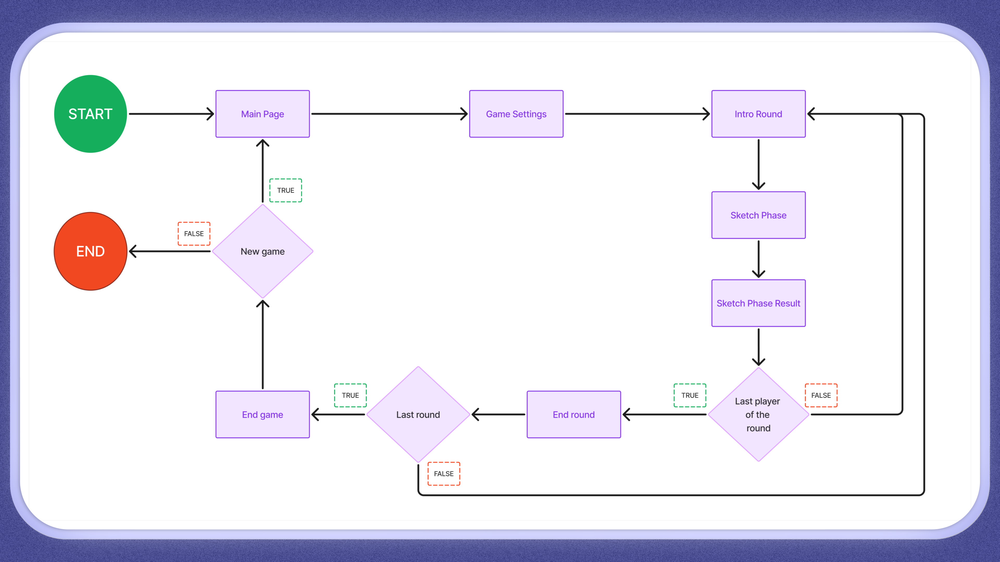

# Sketch Wizards


🌟 **Welcome to Sketch Wizards** 🌟

A drawing game developed for the **LG Web OS Hackathon 2024**! 🎨✨

[**Hackathon Details**](https://weboshackathon.lge.com/)

## Overview

**Sketch Wizards** is an interactive drawing game developed for the LG Web OS Hackathon 2024. The game is designed for up to 8 players who use a Magic Remote to draw on an LG TV screen. An advanced machine learning model interprets and guesses the drawings in real-time, providing a competitive experience with dynamic leaderboards and multiple rounds.

## Project Objectives

- **Minimize package dependencies** to ensure optimal compatibility with the Web OS platform.
- Ensure broad compatibility and stable performance across **Linux**, **Web**, and **webOS** environments.

## GameLoop


## Key Features

- **Multi-Player Support**: Up to 8 players can join the fun simultaneously. 🎉
- **Customizable Settings**: Personalize player names, adjust time limits, and set the number of rounds. ⚙️
- **Real-Time AI Interaction**: A machine learning model interprets and guesses the sketches drawn by players. 🤖🖍️
- **Dynamic Leaderboards**: Check out scores and rankings after each round. 📊

## Machine Learning Integration

The game utilizes [**MLDart**](https://github.com/LucaTedeschini/MLDart), a Dart-based machine learning project, to interpret and analyze the drawn sketches. This provides real-time feedback to the players and enhances the gameplay experience.

## Personal Considerations
Joining the LG Web OS Hackathon 2024 gave me early access to the WebOS platform for Flutter, where my team faced the unique challenge of optimizing code to meet platform-specific limitations, such as reducing package dependencies for better performance and optimizing the ML package for this purpose.

## Getting Started

1. **Clone the Repository**
   ```bash
   git clone https://github.com/noceg43/SketchWizards.git
   cd sketch-wizards
2. **Install Dependencies**
   ```bash
   flutter pub get
2. **Run the Application**
   ```bash
   flutter run

## Live Demo

Access the live demo here: [Sketch Wizards Web Demo](https://noceg43.github.io/sketchWizardWEB/)